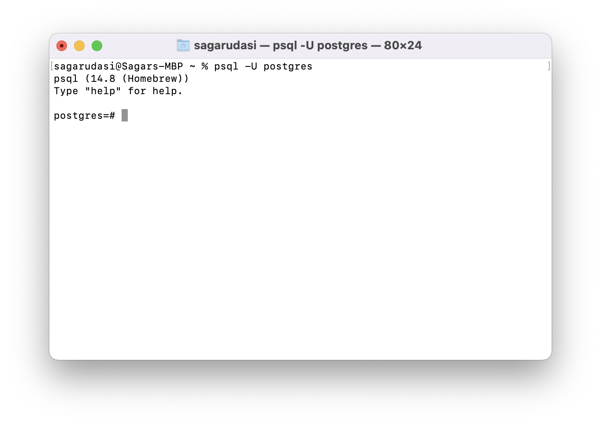
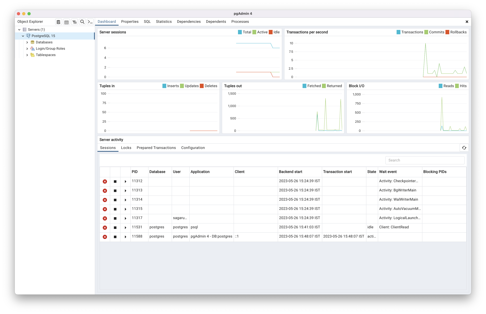

### 26 May 2023

I wish to make a website which is like Codechef/Codeforces/Leetcode. There will be practice problems, users will submit the code and that code will run against the testcases to give the relevant verdict. 

For this, I decided to go with this tech stack: 
* Frontend: React 
* Backend: Django
* Database: Postgresql

#### React Setup

I created two folders `<name>-client` and `<name>-server`. These two will act as two separate repositories. 

In the client folder, 

```sh
$ npx create-react-app .
```

#### Django Setup

In the server folder, I ran the following commands:

```sh
$ python3 -m venv env
$ source /env/bin/activate
$ pip3 install django
$ django-admin startproject <name>-server
```

#### PostgreSQL setup

I didn't have the postgresql installed on my system. I tried to install it using EDB installer for MacOS, but it caused some issues, mainly `psql` command was not working on terminal. So, I used homebrew to install that. 

```sh
$ brew install postgresql
$ brew install --cask pgadmin4
```

**When I open pgAdmin4 to create a new server, I get the prompt: `Please enter the password for the user "postgres" to connect the server Postgresql 15.` On submitting the password, I get the error: `Port 5432 failed: could not receive data from the server.`**

This usually means that the postgres service is not running. 

* **For Ubuntu:**

1. Confirm the running server: Check if the PostgreSQL server is running. You can use the following command to verify its status: 
```sh
$ sudo service postgresql status
```

2. If it's not running, start the server using:
```sh
$ sudo service postgresql start
```

* **For MacOS:**

On macOS, PostgreSQL is typically installed using Homebrew, and the service management commands are slightly different. Here's how you can check the status of PostgreSQL on macOS:

1. Check the status of PostgreSQL using the following command:
```sh
$ brew services list
```

Look for the entry that corresponds to PostgreSQL. It may be listed as postgresql or postgres. The output will indicate whether it's started, stopped, or if there's an error.

2. If you don't see PostgreSQL listed, it means it's not currently managed by Homebrew services. In that case, you can try starting PostgreSQL manually using the following command:

```sh
$ brew services start postgresql
```

After starting, you can check the status again using `brew services list` to ensure it's running.

**After running the server, I try again. On submitting the password, I get the error: `FATAL: role "postgres" does not exist.`**

I go to the terminal, to check this and it's true. 

```sh
$ psql -U postgres
psql: error: connection to server on socket "/tmp/.s.PGSQL.5432" failed: FATAL:  role "postgres" does not exist
```

I try to create a postgres superuser using the following command, but couldn't.

```sh
$ sudo -u postgres createuser --superuser postgres
sudo: unknown user: postgres
sudo: error initializing audit plugin sudoers_audit
```

The error message `sudo: unknown user: postgres` indicates that the user 'postgres' does not exist on your macOS system. By default, macOS does not create a user named 'postgres' during installation.

When installed postgres via Homebrew, it's possible that the superuser role was created with the same name as your macOS username. I ran the following command and **it worked.**

```sh
sudo -u <macOS_username> createuser --superuser postgres
```

Replace `<macOS_username>` with your actual macOS username.

```sh
$ psql -U postgres
psql (14.8 (Homebrew))
Type "help" for help.

postgres=# 
```

**On pgAdmin4, now when I put the the password for the superuser postgres, it works.**

You should see this screen on terminal:



and on pgAdmin, you should see this: 



Because I need to work extensively on Postgresql, here I decide to study as much as possible about Postgresql.

<hr>